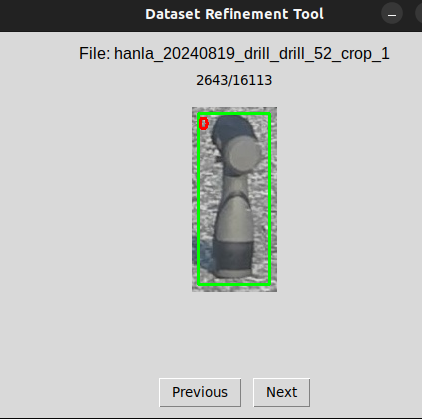

# Dataset_refine_tool

##Example

###

```plaintext
이미지와 라벨링(txt) 파일을 읽어와 이미지와 어노테이션을 표시해줍니다. GUI 내에서 라벨링 박스 수정 및 추가, 제거 가능 
인자 값을 통해 특정 라벨만을 확인할 수 있습니다. 
```

### 사용법

```plaintext
python [refine_tool.py] <dataset_base_path>
```

### 기능 설명
```plaintext
- 좌클릭: 바운딩 박스 클릭 시 수정/삭제 팝업 표시
- 우클릭: add ambiguity / add box 팝업 표시
- A: 새로운 바운딩 박스 추가 (4가지 점을 클릭해서 추가)
- M: 선택한 바운딩 박스 수정 (4가지 점을 클릭해서 수정)
- R: 선택한 바운딩 박스 삭제
- 좌우 화살표: 이전/다음 이미지로 이동
- 창 닫을 때: 진행률 저장
```
